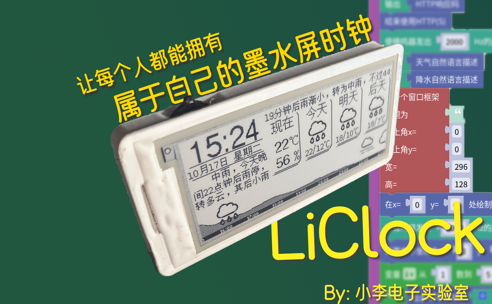

# <center>LiClock-S3 全反屏天气时钟
## tips:此分支因为在最新版本arduino-esp32编译通过后无法正常启动,具体表现是littlefs挂载时底层api发生内存访问错误,暂时未能解决,故暂时搁置
### <center>一种兼具易用性与扩展性的多功能全反屏天气时钟 


## 项目简介

LiClock-S3 是一个基于 ESP32-S3 的多功能全反屏天气时钟项目，具有丰富的功能和良好的扩展性。它不仅可以显示天气信息，还集成了多种实用工具和应用程序，支持通过 Lua 脚本进行功能扩展。

## 功能特性

### 核心功能
- **天气显示**：实时显示天气信息，包括温度、湿度、气压等
- **时间显示**：精确的时间显示，支持 NTP 自动校时
- **低功耗设计**：优化的电源管理，延长电池续航时间
- **波轮按键**：三按键操作，提供直观的用户交互体验

### 应用程序
- **电子书阅读器**：支持文本文件阅读
- **音乐播放器**：支持多种音频的播放
- **文件管理器**：方便的文件浏览和管理
- **温湿度监测**：实时显示环境温湿度数据
- **天气预警**：及时获取天气预警信息
- **系统设置**：丰富的设置选项
- **Web 配置**：通过网页进行设备配置
- **Lua 应用**：支持自定义 Lua 脚本扩展功能

### 外设支持
- **AHT20** 温湿度传感器
- **SHT30** 温湿度传感器
- **BMP280** 气压传感器
- **SGP30** 空气质量传感器
- **DS3231** 实时时钟模块
- **SD 卡** 文件存储

## 硬件说明

### 主要组件
- **主控芯片**：ESP32-S3
- **显示屏**：ST7305 全反屏（384x168 分辨率）
- **按键**：左、中、右三个按键
- **电源管理**：支持锂电池供电和 USB 充电

### 硬件购买注意事项
主控: ESP32-S3R2 

### 核心组件
- **AppManager**：应用程序管理器，负责应用的加载、切换和管理
- **HAL**：硬件抽象层，统一管理硬件资源
- **GUI**：图形用户界面，提供基础的UI元素和交互
- **WebServer**：Web服务器，支持通过浏览器配置设备
- **Lua 解释器**：支持Lua脚本扩展功能

### 主要应用
1. **天气时钟 (clock)**：主屏幕应用，显示天气和时间信息
2. **电子书 (ebook)**：文本阅读器
3. **音乐播放器 (musicplayer)**：音频播放器
4. **文件管理器 (filemanager)**：文件浏览和管理工具
5. **设置 (settings)**：系统设置应用
6. **网页配置 (webserver)**：Web配置界面
8. **温湿度监测 (demoaht20/demobmp280)**：传感器数据显示
10. **Lua应用管理器 (installer)**：Lua应用安装和管理

## 使用说明

### 拨轮开关使用说明
|  按键   | 短按功能  | 长按功能 |
|  ----  | ----  | ---- |
| 左键  | 输入数字/时间：当前位-1 | 返回上个App<br/>输入数字/时间：光标左移<br/>电子书：上一页 |
| 右键  | 输入数字/时间：当前位+1 | 输入数字/时间：光标右移<br/>电子书：下一页|
| 中键  | 确认 | 重置输入为默认值 |

### Lua 应用开发
本项目支持通过 Lua 脚本扩展功能，开发者可以创建自定义应用。

#### Lua App 编写规范
每个 Lua 应用都是一个文件夹，文件夹名称以 .app 结尾，包含以下必需文件：
- `main.lua`：应用主程序
- `conf.lua`：应用配置文件
- `icon.lbm`：应用图标（可选，32x32像素）

#### conf.lua 配置项
- `title`：应用显示名称（必需）
- `wakeupIO1`：唤醒IO1（可选）
- `wakeupIO2`：唤醒IO2（可选）
- `noDefaultEvent`：是否禁用默认按钮事件（可选）
- `peripherals_requested`：请求的外设（可选）

#### main.lua 可用函数
- `setup()`：应用初始化函数
- `lightsleep()`：进入轻度睡眠前调用
- `wakeup()`：唤醒后调用
- `exit()`：应用退出时调用

### 点此查看[Lua App编写规范](src/lua/README.md)  

## 开发指南

### 项目结构
```
LiClock/
├── src/                 # 源代码目录
│   ├── apps/            # 各个应用程序
│   ├── lua/             # Lua引擎和模块
│   ├── webserver/        # Web服务器相关文件
│   └── ...              # 其他源文件
├── include/             # 头文件目录
├── lib/                 # 第三方库
├── data/                # 数据文件
├── images/              # 图片资源
└── platformio.ini       # PlatformIO配置文件
```

### 编译和烧录
本项目使用 PlatformIO 进行编译和烧录，请确保已安装 PlatformIO 开发环境。

1. 克隆项目到本地
2. 使用 PlatformIO 打开项目
3. 连接 ESP32 开发板
4. 编译并烧录固件

## <center>其它
### midi转buz[请看Wiki](https://github.com/diylxy/LiClock/wiki/midi%E8%BD%ACbuz)  

### 图像转lbm[请看Wiki](https://github.com/diylxy/LiClock/wiki/%E5%9B%BE%E5%83%8F%E8%BD%AClbm)  

## <center> 开源协议
### 因为用了彩云天气的API，仅供学习研究，如果需要商用，则不得包含此源代码或由其产生的二进制文件  
### 本项目src路径下的代码没有使用其它任何与墨水屏相关的项目代码  
源代码开源协议为**GPL-3.0**，允许开源情况下商用，但请标明原作者和工程链接，不得售卖源代码或作为闭源项目发布  
另外，按照GPL-3.0协议要求，由此项目衍生出的代码也需要以GPL3.0开源  
此处的开源指使任何人可以自由且免费地获得、修改**源代码**和（或）**硬件工程源文件**  
