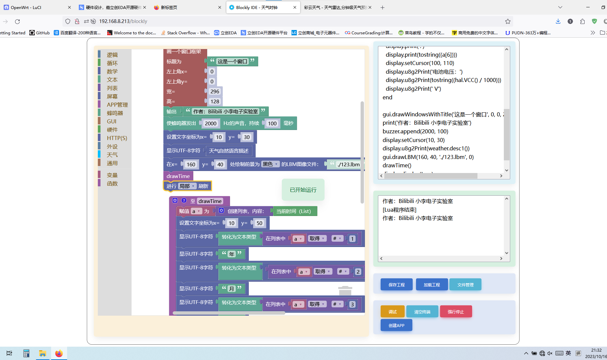

# LiClock - 墨水屏天气时钟


## 简介
LiClock 是一种兼具易用性与扩展性的多功能墨水屏天气时钟。本项目基于原版 LiClock 2.0.10 进行修改，兼容新旧版硬件,但是本项目的音频播放需要额外的硬件支持，群主原工程地址[前往](https://github.com/diylxy/LiClock)。

## 主要特性

### 与原版的对比
- 取消 BMP280、AHT20、天气预警、电源、误差补偿的默认隐藏，并在'app管理'中添加了对app在菜单的可见性设置
- 新增贪吃蛇、文件管理、应用程序管理等功能
- 对设置 APP 进行了全面优化：
  - 改变了闹钟设定响铃日期的输入方式
  - 新增"关于"页面
  - 网络设置中新增搜索周围 WIFI 功能
  - 其他设置增加：
    - CPU 频率设置
    - SD 卡时钟频率设定
    - 长按判断时间设定
    - 休眠电压设定（电量不足自动休眠，避免触发电池保护板保护）
    - 电池电压校准（支持外部仪表校准和芯片 eFuse 的 ADC 校准）
    - TF 加载方式（TF 卡电源供给方式选择）
- 增强app管理，允许自定义显示在app列表中的app

### 扩充后的内置应用程序(Apps)
项目包含丰富的内置应用程序，涵盖了多种功能类别：
- **时钟类**: 天气时钟显示(新增'一言'显示)、仅时钟显示
- **传感器类**: AHT20/BMP280/SGP30温湿度传感器、DS18B20温度传感器(实验性)、INA219电源监测(实验性)、RTC时间补偿等
- **娱乐类**: 贪吃蛇游戏、收音机(实验性)、音频播放器
- **工具类**: 文件管理器、网页服务器、安装器、调试工具、十六进制查看器、LBM图像查看器
- **实用功能**: 天气预警、B站粉丝数显示、GPS定位(实验性)、电子书阅读器(支持竖屏模式)
- **系统设置**: 新版设置应用、引导设置(OOBE)

### 文件管理
- **退出**：选择任意文件，在弹出选项中选择"退出"
- **重命名**：例如，将 SD 卡根目录的 a.txt 改为 b.txt，需输入 `/b.txt`，系统会给出确认提示
- **复制**：
  - 仅支持 littlefs<-->TF 卡（FAT16/FAT32）间复制,暂不支持littlefs和TF在各自的文件系统里复制
  - 选择文件夹时默认选择 `/userdat`
  - littlefs→TF 卡不检查剩余空间，TF 卡→littlefs 会检查空间
- **支持打开的文件**：
  - 运行 Lua 脚本，支持热加载配置文件
  - 播放 buz 音频文件
  - 显示 jpg/bmp 图片
  - 以 hex 方式查看文件内容
  - lbm 文件支持 2/4/16 阶灰度显示（需使用转换工具，4/16 阶灰仅在 UC8151 上支持）
  - 包含灰阶元信息的[lbm转换程序](https://kanfandelong.github.io/liclock-web-flash/image.py)
  - txt 会自动跳转至ebook
  - mp3,wav,aac,opus,flac会自动跳转至MusicPlayer
- **文件管理的菜单标题**：
  - 会自动根据文件路径显示所需的长度自动省略部分路径

### 音乐播放器
- **操作逻辑**
  - 短按中键: 音乐列表
  - 长按中键: 菜单
  - 短按左键: 减小音量
  - 长按左键: 上一首
  - 短按右键: 增大音量
  - 长按右键: 下一首
- **其他说明**
  - 格式支持:mp3,wav,aac,opus,flac(高码率flac会出现卡顿,原因是走spi读卡的带宽不够)
  - id3标签显示(仅MP3类型的音频)
  - 歌词显示,需要将与歌曲同名的lrc歌词文件放在歌曲同级目录的lrc文件夹里
  ```
  ../
  ├── lrc/
  │   └── 歌曲.lrc
  ├── 歌曲.mp3
  └── ...
  ```
- **预生成播放列表**
  - 程序在生成播放列表时会检查根目录的playlist中是否有对应的预生成播放列表,如果没有则会直接扫描文件夹来构建(在文件夹嵌套越深,歌曲越多,耗时越久)
  - 预生成播放列表的实际格式是txt文本,命名规则是:当前文件夹名+npl扩展名

### 贪吃蛇
- 左键：蛇头逆时针旋转
- 右键：蛇头顺时针旋转
- 中键：打开菜单

## 硬件购买注意事项

- **屏幕型号**：`E029A01`(灰度显示还未完成)或 `WFT0290CZ10`(支持灰度显示)
- **ESP32 模组**：推荐 wroom 或其它封装和引脚兼容的模组，建议选择大容量 Flash
- **注意**：尽量不要购买 esp32-solo-1，虽然能用但价格无优势（除非使用拆机件）
- 其他元器件请按照 BOM 清单购买，购买前请认真阅读[元器件购买相关说明](https://github.com/diylxy/LiClock/wiki/%E5%85%83%E5%99%A8%E4%BB%B6%E8%B4%AD%E4%B9%B0)

## 软件使用说明

### 程序烧录
[详细指南](https://github.com/diylxy/LiClock/wiki/%E5%9B%BA%E4%BB%B6%E7%83%A7%E5%BD%95)

### 手动编译固件
[详细指南](https://github.com/diylxy/LiClock/wiki/%E6%89%8B%E5%8A%A8%E7%BC%96%E8%AF%91%E5%9B%BA%E4%BB%B6)

## 操作指南

### 拨轮开关使用说明

| 按键 | 短按功能 | 长按功能 |
| ---- | -------- | -------- |
| 左键 | 输入数字/时间：当前位-1 | 返回上个 App<br/>输入数字/时间：光标左移<br/>电子书：上一页 |
| 右键 | 输入数字/时间：当前位+1 | 输入数字/时间：光标右移<br/>电子书：下一页 |
| 中键 | 确认 | 重置输入为默认值 |

## 开发者资源

### Lua App 编写规范
[详细文档](src/lua/README.md)

### Blockly
当前 Lua 语言与 Blockly 尚未完全适配，部分"积木"后续将进行修改(新增的ttf字体渲染接口还未接入"积木")。

#### 使用截图


## 实用工具

### MIDI 转 BUZ
[转换工具指南](https://github.com/diylxy/LiClock/wiki/midi%E8%BD%ACbuz)

### 图像转 LBM
[转换工具指南](https://github.com/diylxy/LiClock/wiki/%E5%9B%BE%E5%83%8F%E8%BD%AClbm)

## 问题反馈

### BUG 反馈
- 如遇报错重启，请提供系统日志
- **反馈渠道**：
  - 在交流群中@我
  - 发送邮件至：2037443617@outlook.com

## 开源协议

- 因使用彩云天气 API，本项目**仅供学习研究**，商用项目不得包含此源代码或其生成的二进制文件
- 项目 src 路径下的代码未使用任何与墨水屏相关的第三方项目代码
- 源代码采用 **GPL-3.0** 协议：
  - 允许开源情况下商用
  - 必须标明原作者和工程链接
  - 禁止售卖源代码或作为闭源项目发布
  - 衍生项目也必须以 GPL-3.0 协议开源
- 本协议所指"开源"是指使任何人可以自由且免费地获得、修改**源代码**和（或）**硬件工程源文件**